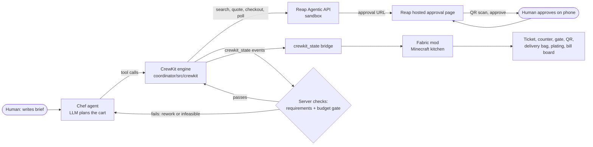

# CrewKit Kitchen

An AI chef turns a workshop attendee list into a supply order that stays inside a small budget. A human approves it on Reap's hosted page, and a Minecraft kitchen shows every step.

Reap x 65labs Agentic Buildathon (Singapore) | Reap Agentic API (sandbox) | [Demo video](TODO_REAL_URL) | MIT

Track: Most Worthwhile Problem.

**The user:** a student-club organiser with an attendee list, S$105 and a shopping list. A forgotten item or an over-budget cart means a second order.

**Real sandbox result:** the first quote was S$196.85, so our server gate blocked checkout. The agent reworked the cart through four quotes (S$196.85, S$137.25, S$131.65, S$102.75) after finding sold-out stock. A human approved with a passkey, and Reap reported `COMPLETED` with S$102.75 charged. Order `ord_01M4G0J3JSEP31G7NASSA0K649`, Popular Bookstore SG, 6 guests. [Details](#whats-real-a-recorded-sandbox-run)

**Honest scope:** this is the Reap sandbox. No money moves and nothing ships; the delivery scene is a visualization. Built on [Agent Arena](docs/AGENT-ARENA.md), my earlier MIT Minecraft agent mod. The Reap client, chef tools, budget gate and kitchen were built at the event.

**Try it without Minecraft:** `node coordinator/src/crewkit/cli.mjs run --mode replay`

## The problem

**The pain:** the organiser must turn the list into an order: compare products across listings, split per-person items from shared ones, add shipping, and remember everything. One forgotten item or one over-budget cart means a second order.

Minecraft is only the display. The point is an agent whose spending you can check.

## What CrewKit does

The organiser gives the chef a brief: guests, a budget, and what each person needs. The chef searches Reap's catalogue, builds a cart, and asks Reap for a quote. Two server checks run before any checkout:

1. **Requirements check.** Every mandatory quantity is covered, for example one badge per guest and one cable per pair.
2. **Budget gate.** The quote total, shipping included, is within budget.

If either check fails, no checkout is created. For a budget failure, the chef reworks the cart by substituting cheaper products while keeping the requirements. If nothing fits, the brief is reported as infeasible instead of quietly dropping items.

When both checks pass:

- Reap returns a hosted approval page. A human scans a QR code and approves there.
- When Reap reports the order as `COMPLETED`, the kitchen shows the order as placed and plays the delivery and plating scene for each named guest.
- A bill board shows budget, quoted, charged, variance, and order id. Order placed; delivery visualized. The sandbox does not ship anything.

The room is the audit log. A red ticket means over budget. Dropped gate bars mean the checkout is blocked. A bag at the door means Reap reported the order placed.

> TODO: organiser testimonial (quote, name, club)

## What's real: a recorded sandbox run

A real Reap sandbox run completed, and the demo replay is that recorded run (the approval URL is redacted).

- **Order:** `ord_01M4G0J3JSEP31G7NASSA0K649` at Popular Bookstore (Singapore). 6 guests, budget S$105.
- **Gate fired:** the first real quote was S$196.85, so the server gate blocked checkout.
- **Stock was limited:** badges and notebooks were sold out at quantity 6, and no single cable listing had 3. The agent swapped to in-stock listings and split quantities (cables 1+1+1, notebooks 3+3).
- **Rework:** the quote went S$196.85, S$137.25, S$131.65, S$102.75. It dropped only the optional sticky notes.
- **Checks passed:** the requirements check and the budget gate both passed. A human approved on Reap's hosted page with a passkey.
- **Result:** `COMPLETED`, charged S$102.75, variance S$0.00.
- **Reliability:** the run used 154 Reap API calls. Reap returned several 503 responses and our backoff recovered.

This is the sandbox. No real money moved, and delivery is visualized, not shipped.

## What you see in the kitchen

- A fan of candidate products from real search results.
- Ghost plates for the cart, which turn solid once paid.
- A typewriter bill and a written-book receipt.
- The chef answers by voice (OpenAI speech-to-text and text-to-speech through Simple Voice Chat) and speaks lines at key beats.
- The chef is summoned and placed automatically. It cannot mine or wander.

## How it works



1. **Chef agent.** An LLM reads the brief and chooses what to search for and buy. It works through a small set of tools and never touches money directly.
2. **CrewKit engine.** Node code in `coordinator/src/crewkit/`. It calls Reap's endpoints, holds the API key, runs the budget gate, and emits events.
3. **Reap Agentic API.** `POST /agentic/products/search`, `POST /agentic/quotes`, `POST /agentic/checkouts`, then `GET /agentic/checkouts/:id` until the status is terminal.
4. **`crewkit_state` bridge.** One new message type on the existing coordinator-to-server bridge. Each event carries a run id and a sequence number, so the mod ignores stale or repeated events. See [docs/crewkit/CONTRACT.md](docs/crewkit/CONTRACT.md).
5. **Fabric mod kitchen.** Turns each event into a physical action in the world.
6. **Human approval.** Happens on Reap's own hosted page, not in our code.

## Money safety

- **Two checks live on the server.** The chef can propose any cart. Our code checks that every mandatory quantity is covered and that the shipping-inclusive quote is within budget. Over-budget quotes cannot create a checkout through our tool. These checks run in our server code, outside the model. This is a property of our tool, not of Reap's API: a client that bypasses our tool is not covered.
- **The key and card never reach the LLM.** The Reap API key stays in a gitignored `.env` read by the engine. Card details are entered on Reap's hosted pages and never pass through our code or logs.
- **A human approves every purchase.** Reap mandates (pre-approved spending) are not live yet, so each checkout needs approval on Reap's hosted page.
- **Show the delivery scene only on `COMPLETED`.** Reap defines it as "the merchant order is placed". `PROCESSING`, `FAILED`, and `EXPIRED` never trigger it. The scene visualizes delivery; it does not confirm that goods arrived.
- **Idempotency.** Every enrollment, quote, and checkout call carries an `Idempotency-Key` that is stored before sending. A retry replays the same result and cannot double-buy.
- **Reconcile against what was charged.** The bill board uses `finalAmount` from the checkout, not the quote.

## Honest disclosure

- The Minecraft agent platform underneath is **Agent Arena**, existing work by the project owner, published under MIT. Its docs are in [docs/AGENT-ARENA.md](docs/AGENT-ARENA.md).
- **Built at the event:** the Reap purchasing client, the chef and its tools, the budget gate, the run record, the `crewkit_state` bridge message, the kitchen set, the visual choreography, and this documentation. Everything under `coordinator/src/crewkit/`, `src/main/java/dev/agaminggod/arenaagents/crewkit/`, and `docs/crewkit/` is new.
- This runs against the **Reap sandbox**. No real money moves and nothing ships.
- Two things are separate in a demo run. **Hosted approval** is a real human step on Reap's sandbox page. **Simulated completion** (`X-Simulate-Checkout: COMPLETED`, used in `simulate` mode) skips that step, and the run is labeled simulated.
- CrewKit makes no onchain claims.

## Quick start

**Fastest check, no Minecraft:** `node coordinator/src/crewkit/cli.mjs run --mode replay`

**Full demo (Minecraft):** the steps below. Releases are pre-releases; the latest is `crewkit-preview-8`.

1. **Game and Java.** Minecraft Java 26.1.2 with Fabric Loader 0.19.3, Fabric API, and Fabric Carpet. Java 25.
2. **Mod.** Put the CrewKit jar from [Releases](https://github.com/aGamingGod1234/crewkit-kitchen/releases) into `mods/`. Only one `arenaagents` jar may be installed, so remove any other Agent Arena jar.
3. **Voice (optional).** Install Simple Voice Chat 2.6.21 or newer and the `arena-agents-voice` jar. Set `OPENAI_API_KEY` as a user environment variable.
4. **Node for the coordinator.** The mod needs Node 22 or newer at this exact path, and it does not use the system PATH:
   ```text
   .minecraft\arena-agents-runtime\runtime\toolchains\node\node.exe
   ```
   You can point somewhere else with the JVM flag `-Darenaagents.nodePath=<path to node.exe>`.
5. **Reap key (simulate or live mode only).** Put `REAP_API_KEY` and `REAP_EMAIL` in `coordinator/src/crewkit/.env` (gitignored). Replay needs no key.
6. **In game.**
   ```text
   /crewkit build            (or: /crewkit build here)
   /crewkit stage            (summons Chef, Claude Opus 5.5 low; the Claude CLI must be logged in)
   /ckcam on
   /codex voice-consent on
   ```
   Then talk to Chef, or send `/msg Chef <order>`. The exact demo message is in [docs/crewkit/AGENT-RUN.md](docs/crewkit/AGENT-RUN.md).
7. **Between takes.** `/crewkit reset`, then `/crewkit chef ready`.
8. **Developer CLI.**
   ```text
   node coordinator/src/crewkit/cli.mjs run [brief] --mode replay|simulate|live
   ```

| Mode | What it does |
|---|---|
| `replay` | Plays a recorded run through the kitchen. No network. |
| `simulate` | Calls the sandbox with `X-Simulate-Checkout: COMPLETED`. Completion is simulated. |
| `live` | Full flow: sandbox card, hosted approval page, polling. Approval is a real human step. |

Docs: [contract](docs/crewkit/CONTRACT.md), [brief and script](docs/crewkit/brief-and-script.md), [Reap API notes](docs/crewkit/reap-api-notes.md), [submission text](docs/crewkit/SUBMISSION.md), [judge Q&A](docs/crewkit/JUDGE-QA.md).

## Team

The Greek Warriors. `TODO: member names`

Repository: https://github.com/aGamingGod1234/crewkit-kitchen (public, MIT)

## License

MIT. See [LICENSE](LICENSE).

## Base platform

CrewKit is built on [Agent Arena](docs/AGENT-ARENA.md), an existing MIT-licensed Minecraft agent mod by the same author. Build, verification and skit-mode docs live there.
