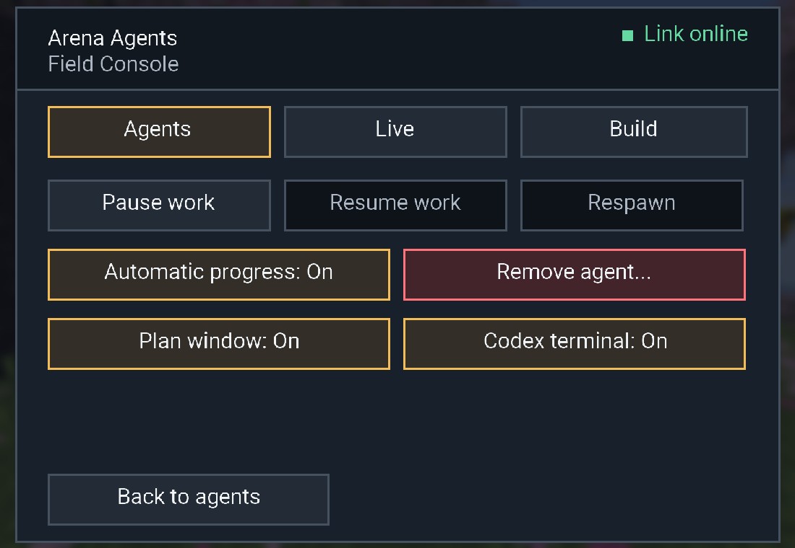

# Remaining local improvements, 2 October 2026

Seven GPT-6.1 Sol subagents completed the remaining preparation, continuous travel, protocol, shutdown, native-window and benchmark work. The selected Minecraft agent still chooses its routes, supply reserves, equipment and responses. Deterministic machinery supplies facts, checks prerequisites and executes its authored choices.

## Changes

- Whole-trip guidance considers food, tool durability and replacements, fuel, worthwhile nearby resources, remembered possessions and reusable workstations. Explicit user quantity limits remain authoritative. The agent records its chosen preparation in existing progress memory.
- `onUnhandledAttention("pause_and_notify", { reassessWhen })` lets an agent waive ordinary notifications along an already chosen leg. Only exact false waives reassessment. Unknown facts, predicate errors and urgent danger return control; fresh observations and watchers remain active. Checkpoints, exhaustion, receipt checks and repeated-failure recovery remain intact.
- Travel guidance uses meaningful verified waypoints and checks every movement receipt, checkpointing on the first failed leg. Existing physical pathfinding, safe local detours and stall recovery are retained.
- The shipped threat example chooses a verified shield response and then requests reconsideration. It does not automatically resume unrelated mining. Runtime does not select a combat tactic or a destination.
- Protocol validation and observation adaptation accept Minecraft's exact infinite-effect sentinel, duration `-1`, while rejecting other invalid values. Finite durations are unchanged.
- Shutdown persists only the location of a living fake-player body whose UUID matches its committed agent record. Dead, detached and pending-respawn records retain recovery facts.
- Native plan and terminal viewers handle independent toggles, close/reopen, preference persistence, agent switching, stale cached packets, offline/reconnect, task replacement and reading position. Explicit fresh tasks clear the prior task even with identical wording; resume and steer retain it.
- Minecraft's main initializer forces Java's headless flag. Early client initialization now restores an explicit launcher setting or lets the JDK detect the desktop. This leaves explicit headless tests headless and does not change dedicated-server initialization.

The approved B dependency map, main-agent editable advisory plan, death/recovery memory and cumulative usage telemetry are retained. The terminal presents the existing Codex process's emitted messages, tools, results and available summaries. Viewer polling starts no extra provider request.

## Current artifact

[Built JAR](../../build/libs/arena-agents-0.2.0.jar)

SHA-256: `0D3A542A8C41DAD92DFADFDE2884B04BD1A56FBE4154AB1F58CDA58A08B3DF34`

All 91 bundled coordinator modules match current source byte for byte. Desktop QA used this exact artifact. At the end of verification, its main installed `.minecraft/mods` JAR still had SHA-256 `753F9DBDB8A775CDDEB803F1531A7E58428251C451DEFE5329DEC9893D142270`.

The user's subsequent “update it” request installed the exact tested artifact in Desktop's main mods folder at `2026-10-02T12:04:26Z`. Minecraft was closed. Atomic replacement preserved a verified backup of the prior JAR outside the mods folder; the installed hash matches the artifact above and exactly one core mod JAR remains. The updated main installation has not been launched by this installation task.

## Verification

- Coordinator: **1,882 passed, three skipped, zero failures** in the full suite.
- Java core: **15,842 assertions** passed; voice addon: **387**; camera/presentation: **19 checks**.
- Gradle build passed. Three fresh-JVM regressions load the actual Minecraft main class and verify explicit true, explicit false and automatic AWT detection. These now run through regular `check`.
- Headless rendering exercised the actual graph, step selection, inventory loss, detail reading position and task reset.
- Desktop native lifecycle: **18 checks** passed through the packaged JFrame implementation. Independent toggles, close/reopen, saved settings, task revision, stale replay, deletion and reconnect were covered.
- Desktop initialized Minecraft 26.1.2 client: **18 checks** passed through actual `AgentControlScreen` mouse input and real Swing frames, using normal automatic desktop detection. This covered both toggles, native-close label updates, reopen, agent switching, late old packets, offline/fresh updates, permission-disabled controls and disconnect cleanup. Roster and live payloads were synthetic; this was not connected to a user world or provider.
- Desktop live Fabric: **six capability checks** passed through the authenticated bridge and physical controls. Infinite Haste stayed connected and completed another action. Chosen queued controls preserved provenance; false and nonboolean guards rejected successors. Exact mining left the adjacent decoy intact and verified inventory pickup. Injected injury cancelled mining, dispatched only the authored retreat in **86.522 ms**, and did not resume mining automatically. This is one injected-injury sample, not model decision latency or an autonomous combat evaluation.
- Live Fabric runtime/agent cleanup and server shutdown completed normally. The detached-body shutdown scenario is covered by focused lifecycle regressions; the live shutdown covered an ordinary committed body.
- `git diff --check` passed. Existing unrelated local work was preserved. No commit, push, PR or merge was performed.

The screenshot comes from the initialized client fixture. Its online roster indicator is supplied test data, not proof of a network connection.

## Performance evidence

The [paired benchmark report](../../reports/cave-navigation-attention-2026-10-02.md) retains the frozen before-source graph and raw measurements. With a declared 100 ms response delay and six 60 ms action timers, route p50 fell from **938–941 ms to 387–388 ms**. Ordinary reconsideration responses fell from six to zero; all 36 predicate pairs were faster. Legacy policies showed no interpreter speedup. Nine boundary cases preserved reassessment and failure behavior.

Those are control-chain measurements against a fake bridge, not Minecraft travel speed, provider inference, FPS or whole-goal completion.

Four real text-only Codex responses compared identical submitted model settings and before/after guidance. In the preparation case, the before response chose three of six safe iron blocks and one spare iron pick; after chose all six and two spares. Both chose food and workstation reuse. Both route responses already chose all six verified waypoints, so no model route-batch increase was demonstrated. One response per case/arm is anecdotal and does not establish optimal reserves or a survival-rate improvement.

The four requests emitted 80,494 input tokens, including 32,384 cached input, and 1,316 output tokens. No account-percentage or dollar conversion is inferred. Other benchmark and artifact checks used zero provider calls.

The physical Fabric comparison passed all six arms and eight evidence checks: three alternating pairs, each with six identical real navigation controls across a turn, one-block ascent and raised ledge. All 36 actions succeeded with full health; fresh observations and independent RCON positions verified the destination. Both arms use the same current JAR with a declared 100 ms ordinary-response fixture, comparing legacy pause policy with the optional authored condition.

| Physical policy metric, p50 | Legacy pause | Authored condition |
| --- | ---: | ---: |
| Route completion | 4,449.900 ms | 3,930.665 ms |
| Receipt to next dispatch | 106.497 ms | 3.360 ms |
| Summed inter-action idle proxy | 535.034 ms | 18.316 ms |
| Ordinary responses per route | 6 | 0 |

All three pairs were faster, approximately **11.7%** at the route median. The route clock contains five inter-leg gaps; the sixth legacy response is outside it. This is actual physics/pathfinding with controlled responses, not provider inference, old/new JARs or a natural-cave evaluation. Runtime, agent and server cleanup passed.

Two preliminary physical runs also completed all movements, but report export exceeded the existing byte bound. The final exporter stores full raw evidence separately and uses compact JSON in the fixture-specific wrapper, preserving the limit and evidence fields. The final complete harness passed; the table uses that run. The original native-successor wrapper is unchanged.

## Scope and limits

Development is local. Desktop testing used an isolated installation, synthetic client packets and prepared Fabric worlds. After verification, the requested main JAR update was installed. The chosen model and speed mode were not changed.

No complete diamond-pickaxe run, autonomous hostile-survival rate, natural-cave perception evaluation, random-seed completion rate or end-to-end model speedup has been demonstrated by these focused checks. The main agent must still author and use the new preparation and attention policies.

All four temporary Desktop QA scheduled tasks were removed after completion. No test Java process remained; the main installed JAR hash was rechecked unchanged. Test worlds and evidence remain in the isolated QA directory.

Current plan: https://vnheb2pqbsru.postplan.dev (installation status included; hosted HTML verified byte for byte against the local plan).
